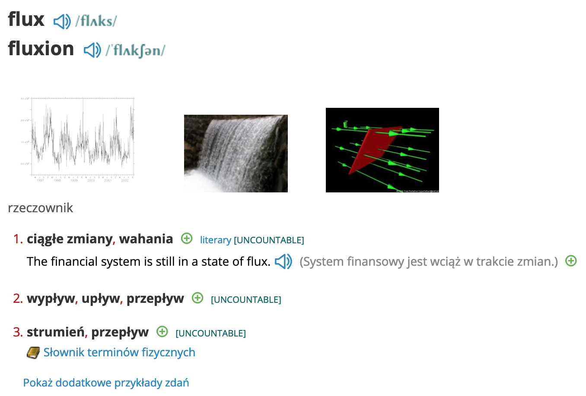
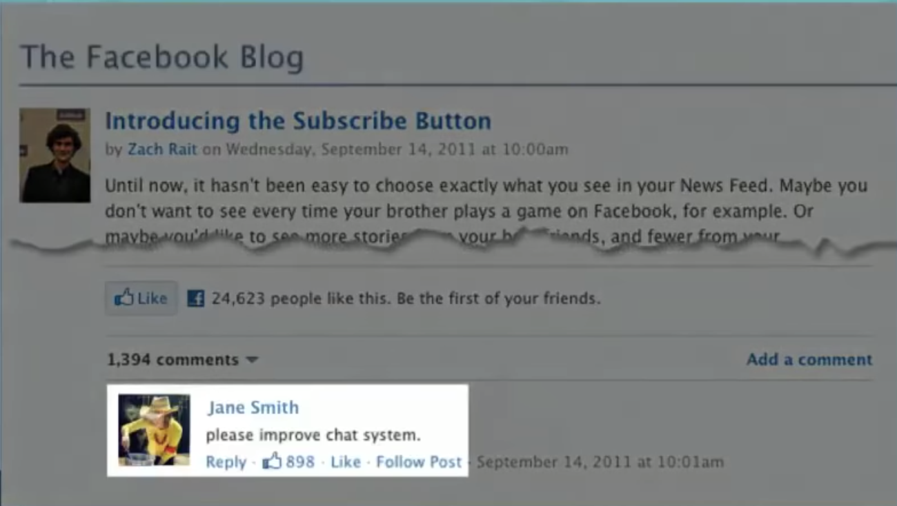
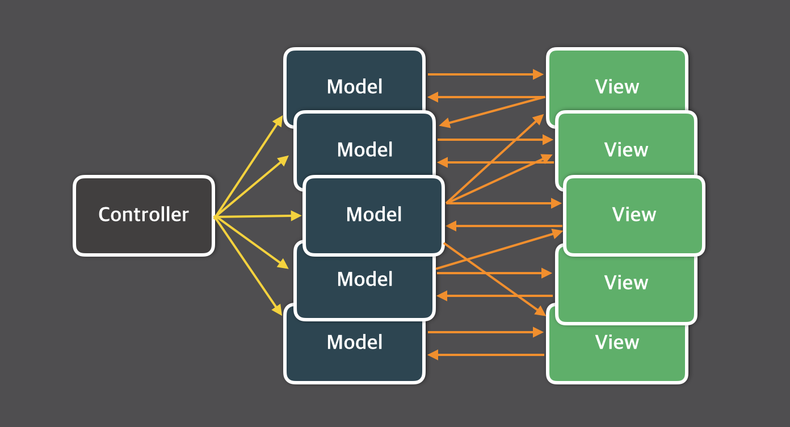

# Flux

---

## Czym jest Flux?

---

## Czym jest Flux?

- Architektura
- Stworzona przez Facebook

---

## Po co to nam? Jaki problem rozwiazuje?

- Problem skalowalnosci w Facebook
- Uzywa jednokierunkowego przeplywu danych zamiast dwukierunkowego

[wiecej na ten temat](https://www.youtube.com/watch?v=nYkdrAPrdcw)

---

## A jaki byl problem skalowalnosci?

---

---

---

---

## Co oznacza jednokierunkowy?

---

---

---

---

- **Action** - obiekt z danymi (wiadomosc)
- **Dispatcher** - wysyla akcje do konkretnych storow
- **Store** - zawiera pewne informacje, rejestruje callbacki, ktore reaguja na wiadomosci wyslane przez dispatchera, emituja zmiany, ktore moga zostac uzyte przez zainteresowanych (np widok).
- **View** - MOZE (nie musi) byc nim React, moze byc zrodlem Akcji

---

### Wazne!

To tylko architektua / pomysl ktory musi zostac zaimplementowany!
