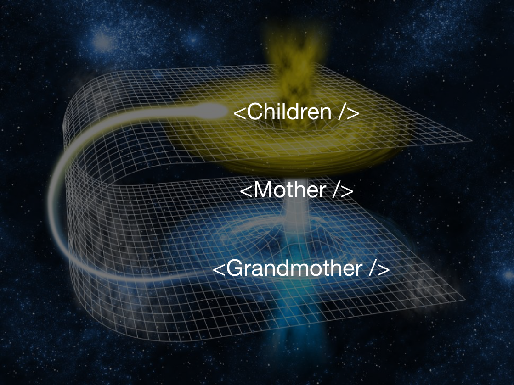

import TweetEmbed from "react-tweet-embed";
import { CodeSurfer } from "mdx-deck-code-surfer";

## Co jest warte zapamietania?

---

### Coz wszystko...

---


---

### Ale tak serio, w kontekscie reduxa

---

## Programowanie funkcyjne

- czysta funkcja
- map
- filter
- reduce

---

## setState

---

Aktualizowanie stanu

```jsx
this.state.counter = 0;
```

---


---

```jsx
this.setState({
  counter: 0
});
```

---


---

```jsx
this.setState({
  counter: this.state.counter + 1
});
```

---

Spojrzmy na ten przyklad

```jsx
handleIncrement = () => {
  this.setState({ counter: this.state.counter + 1 });
  this.setState({ counter: this.state.counter + 1 });
  this.setState({ counter: this.state.counter + 1 });
};

// this.handleIncrement()
// console.log(this.state.counter)
```

---

Poprzedni przyklad to to samo co:

```jsx
Object.assign(
  {},
  { counter: this.state.counter + 1 },
  { counter: this.state.counter + 1 },
  { counter: this.state.counter + 1 }
);
```

---

Jak to naprawic?

```jsx
handleIncrement = () => {
  this.setState(prevState => ({ counter: prevState.counter + 1 }));
  this.setState(prevState => ({ counter: prevState.counter + 1 }));
  this.setState(prevState => ({ counter: prevState.counter + 1 }));
};
```

---

```jsx
this.setState(prevState => {
  return {
    counter: prevState.counter + 1
  };
});
```

---

setState jest asynchroniczny

```jsx
console.log(this.state.counter); // 0
this.setState((prevState, props) => {
  return {
    counter: prevState.counter + props.amount
  };
});
console.log(this.state.counter); // 0 :(
```

---

setState jest asynchroniczny

```jsx
console.log(this.state.counter); // 0
this.setState(
  (prevState, props) => {
    return {
      counter: prevState.counter + props.amount
    };
  },
  () => {
    console.log(this.state.counter); // 1 :)
  }
);
```

---

<TweetEmbed id="824308413559668744" />

---

### Reguly:

1. Update powinien byc w `setState()`
2. Do `setState()` mozna przekazac typy `object` albo `function`
3. Wrzuc `function` kiedy wielokrotnie updateujesz stan
4. Nie odwoluj sie do `this.state` zaraz po wywolaniu `setState()`. Przekaz callback jako drugi parametr!

---

## React Context

---

<div
  style={{
    backgroundColor: "#efefef"
  }}
>
  <CodeSurfer
    title="Prop drilling"
    code={require("!raw-loader!snippets/prop-drilling.jsx").default}
    showNumbers={false}
    dark={false}
    steps={[
      { notes: "Czym jest prop drilling?" },
      { lines: [4, 5, 6], notes: "Grandmother posiada stan" },
      { lines: [17, 18, 19], notes: "Child potrzebuje tego stanu" },
      { lines: [13, 14, 15], notes: "Ale musi go przeslac przez Mother" },
      { lines: [9], notes: "A wiec musimy przekazac..." },
      { lines: [14], notes: "stan" },
      { lines: [18], notes: "w doł" }
    ]}
  />
</div>

---

### Rozwiazanie problemu za pomoca contextu

```jsx
import React from "react";

const FamilyContext = React.createContext({});

export const FamilyProvider = FamilyContext.Provider;
export const FamilyConsumer = FamilyContext.Consumer;
```

---

<div
  style={{
    backgroundColor: "#efefef"
  }}
>
  <CodeSurfer
    title="Context solution"
    code={require("!raw-loader!snippets/context-solution.jsx").default}
    showNumbers={true}
    dark={false}
    steps={[
      { lines: [5, 6, 7], notes: "Grandmother posiada pewien stan" },
      {
        lines: [11, 12, 13],
        notes:
          "Opakowujemy komponenty ktore przekazuja dostep do lastName w FamilyProvider."
      },
      { lines: [18, 19, 20], notes: "Mother nie ma juz prop drillingu" },
      {
        range: [22, 26],
        notes:
          "Opakowujemy komponenty ktore potrzebuja dostepu do lastName w FamilyConsumer"
      },
      { notes: "" }
    ]}
  />
</div>

---



---

> Regula kciuka: jesli zaczynasz sie irytowac jak dlugo zajmuje przekazanie danych z gory przez propsy w dol, wprowadz Context.

---

Przyklady zrodla irytacji w Todo app

---

Stworzenie kontekstow w naszej aplikacji
